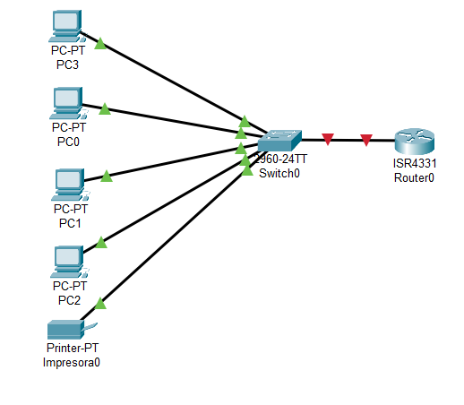

# Proyecto Redes Locales - Tienda Online de Accesorios de Moto

## Descripción
Este proyecto consiste en el diseño de una red local para una tienda online de accesorios para motociclistas.

## Contenido del proyecto
- Análisis de necesidades de red
- Diseño de la red
- Plan de direccionamiento IP
- Servicios de red
- Pruebas de conectividad

## Diseño de la red
La red está compuesta por varios ordenadores conectados a un switch, que a su vez se conecta a un router para proporcionar acceso a internet.

## Funcionamiento
Se ha comprobado la conectividad entre los equipos mediante el uso del comando ping, verificando que la red funciona correctamente.
## Diagrama de red

## Autor
Victoria Teresa Arroyo Peña
